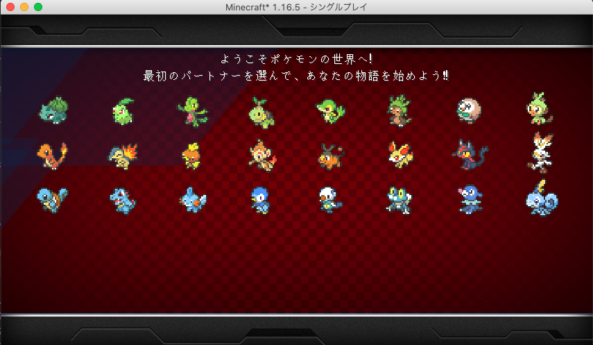

🌙 minecraft-pokemon-scratch
====

## 📗 プロジェクトの概要

Minecraft で Pixelmon (ポケモンmod) を利用する為の環境を構築します。
ポケモンと一緒にMinecraftで遊ぶことができます。
また、Scratch を連携させることで子供向けのプログラミング教材としてもご利用できます。

### 対象としている方
- Minecraftのアカウントを購入済みの方
- プログラミングに興味がある小学生とその保護者の方
- これを機にプログラミングを学んでみたい方
- ポケモンが好きな方

## 🌐 Demo


## 🖊️ 環境構築

環境構築の流れ
1. Minecraftをダウンロードしてインストールする
2. Minecraftを起動する為に必要なJavaをインストールする
3. MinecraftでModを利用するために必要なForgeをインストールする
4. MinecraftでPixelmonを利用する準備をする

### Minecraftをダウンロードしてインストールする
[こちら](https://www.minecraft.net/ja-jp/store/minecraft-java-bedrock-edition-pc) からMinecraftをダウンロード後、ご利用にPCにインストールしてください。
PC版のMinecraftには、Java版と統合版の2種類がありますが、Java版の方が Pixelmon などのModが利用できる為、拡張性が高くオススメです。
[こちら](https://www.minecraft.net/ja-jp/store/minecraft-java-bedrock-edition-pc) のリンクからインストールしてください。
インストール後は5日間は無料で遊ぶことが出来ますので、問題なく動作することを確認してからアカウントを購入されることをオススメします。


### Minecraftを起動する為に必要なJavaをインストールする
MinecraftはJavaと呼ばれるプログラミング言語で作られているため、動作に必要なランタイムをPCにインストールする必要があります。 
[こちら](https://adoptium.net/temurin/releases/?version=17) からご利用のPCのOSに適したJDK17をダウンロード後、PCにインストールしてください。


### MinecraftでModを利用するために必要なForgeをインストールする
MinecraftにModを追加して動かすためにはForgeをインストールする必要があります。
[こちら](https://adfoc.us/serve/sitelinks/?id=271228&url=https://maven.minecraftforge.net/net/minecraftforge/forge/1.16.5-36.2.34/forge-1.16.5-36.2.34-installer.jar) からforge 1.16.5 のバージョン 36.2.34をインストールします。
ダウンロードした`forge-1.16.5-36.2.34-installer.jar`を開くと、Forgeのインストール画面が表示されるのでMinecraft本体がインストールされているディレクトリを指定してForgeを適用してください。


### MinecraftでPixelmonを利用する準備をする
[こちら](https://github.com/isystk/minecraft-pokemon-scratch) からPixelmonの環境構築に必要なコードをダウンロードします。


ダウンロードしたZIPファイルを解凍して任意のディレクトリに配置してください。
[こちら](http://adfoc.us/24937884932780) からMinecraftでポケモンMODを利用するために必要な`Pixelmon-1.16.5-9.0.6-universal.jar`ファイルをダウンロードして、modsディレクトリに配置してください。
[こちら](http://adfoc.us/serve/sitelinks/?id=475250&url=http://optifine.net/adloadx?f=OptiFine_1.16.5_HD_U_G8.jar&x=1cf6) から、Minecraftの動作を軽量化してくれる`OptiFine_1.16.5_HD_U_G8.jar`ファイルをダウンロードして、modsディレクトリに配置してください。

## 📦 ディレクトリ構造

最終的なディレクトリ構成は以下のようになる想定です。
```
.
├── LICENSE
├── README.md
├── config
│    ├── forge.cfg
│    ├── forgeChunkLoading.cfg
│    ├── pixelmon.hocon
│    ├── raspberryjammod.cfg
│    └── splash.properties
├── logs
├── mcpipy (Pythonで作成したプログラムコードを格納)
├── mods
│    ├── OptiFine_1.16.5_HD_U_G8.jar
│    └── Pixelmon-1.16.5-9.0.6-universal.jar
├── options.txt
├── optionsof.txt
├── pixel.dat
├── pixelmon
│    └── quests
├── resourcepacks
├── saves
├── scratch (Scratchで作成したプログラムコードを格納)
├── server-resource-packs
├── servers.dat
├── usercache.json
└── usernamecache.json
```

## 🔧 起動構成の設定

Minecraft を起動したら、「起動構成」-「新規作成」からModを利用できるように設定をします。
```
名前：ポケモン9.0-1.16.5-36.2.34
バージョン：release 1.16.5-forge-36.2.34
ゲームディレクトリ：＜このGithubコードをダウンロードして解凍したディレクトリ＞

必要に応じて、以下を変更するとメモリ使用量が調整できます。
その他のオプション：JVMオプション
-Xmx2G → -Xmx4G 
```


作成した起動構成を保存して起動すると、初回にポケモンを選択する画面が表示されれば準備完了です。




## 💬 プログラミングでMinecraftを操作する

Minecraftを`クリエイティブ`で起動すると、コマンドが利用できるようになります。
コマンドから、PythonやScratchで作成したプログラミングコードを呼び出すことで、自動的に造形物を作成したりすることが出来るようになります。

#### Python で作成したコードを実行してみる
mcpipy ディレクトリに格納したPythonのコードは、/py コマンドで呼び出すことができます。
```
# 巨大な時計を出現させます
/py clock
```

#### Scratch で作成したコードを実行してみる
[こちら](https://manaviva.github.io/scratch-gui/) からScratch3 を開き、左下の拡張機能ボタンから「Micramming」を選択します。


上記は、自分の近くに石のブロックを10個並べて作成するプログラムです。
scratch ディレクトリにあるコードを「ファイル」-「コンピュータから読み込む」するとロードされるのでフラッグをクリックすると実行されます。

#### その他のよく使うコマンドを記載しておきます。
```
# ポケモンを取得する
/pokegive プレーヤー名 ポケモン名

# 野生のポケモンを出す
/pokespawn ピカチュウ

＃ 朝にする
/time set day

# ゲームモードを変更する
/gamemode survival
/gamemode creative

# 造形物を作る
/struc
```

## 🎨 参考

| プロジェクト| 概要|
| :---------------------------------------| :-------------------------------|
| [Reforged 公式サイト](https://reforged.gg/)| マイクラでポケモンmod(Ver.8.1)の入れ方|
| [スクラッチ3.0を使ったマイクラプログラミング学習の始め方](https://rserver-osusume.com/programming-school/minecraft-programming-with-scratch/)| スクラッチ3.0を使ったマイクラプログラミング学習の始め方|
| [利用可能なポケモン](https://pixelmonmod.com/wiki/Available_Pok%C3%A9mon/ja)| 利用可能なポケモン|


## 🎫 Licence

[MIT](https://github.com/isystk/laravel-react-boilerplate/blob/master/LICENSE)

## 👀 Author

[isystk](https://github.com/isystk)
